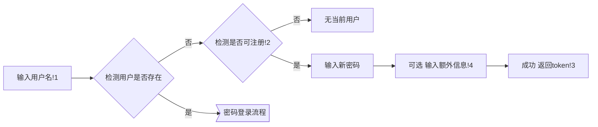
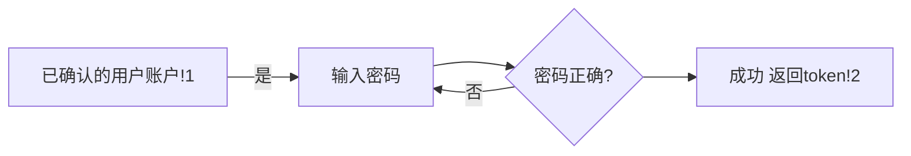
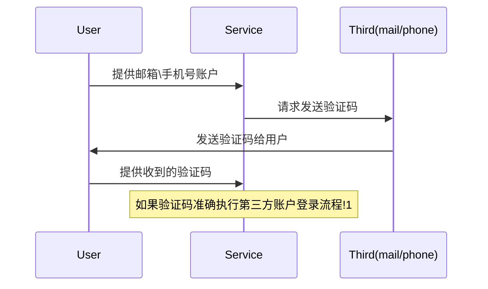
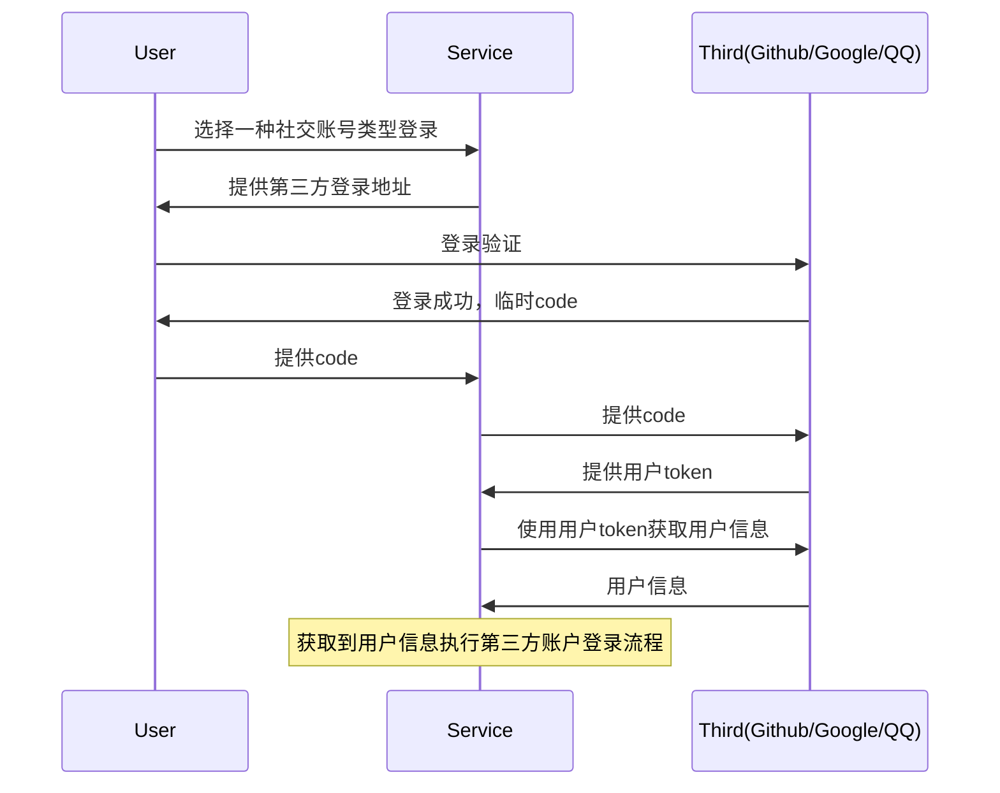
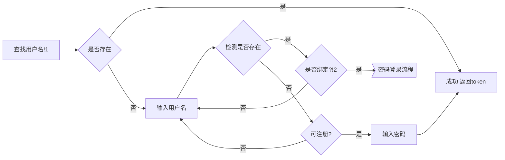

# 简介
以用户名为基础的账户体系，一个用户名对应一用户，而第三方账户（邮箱、手机号、社交账户等）关联至用户名，最初的目的为实现多邮箱账户，但事实上，该方案还有其他很多益处
1. 减少了第三方账户与用户的耦合（中间交互以系统内的用户名为桥梁）,第三方账户的增删改，对用户账户无影响
2. 解决实际项目中，棘手的多邮箱问题，已知GitHub邮箱，无论主副都可作为登录名，在设计时参考GitHub的账户体系。并扩展至支持多社区账户。

# 主流程

**Tips**   
1. 输入用户名判断是否存在，能有效的改进用户遗忘帐号时的体验。另一种主流的观点，不提供用户名存在信息能有效避免Hacker攻击存在的账户，事实上，意义不大，除非您的系统不存在社交属性，例如Facebook，Twitter，QQ等，您可以通过搜索好友的方式判断账户是否存在。
2. 判断是否可注册的依据，是您是否希望邮箱、手机号等与用户名同时作为账户通过密码登录
3. token是包含用户信息的签名，例如[jwt](https://jwt.io/)
4. 额外信息可让用户额外提供手机号邮箱等，保障账户不被滥用

# 密码登录流程

**Tips**   
1. 用户账户需要通过用户名或者第三方账户查询到，并由用户确认是其账户
2. token是包含用户信息的签名，例如[jwt](https://jwt.io/)

# 第三方账户
 第三方账户分为以邮箱手机号为主的验证码方式登录的账户与以GitHub、Google、QQ为主的社交账户。

## 验证码流程

**Tips**   
1. 不准确，需要重新执行该流程

## 社交账号
社交账号比较常见的是OAuth2.0流程

## 第三方账户登录流程

**Tips**   
1. 根据第三方账户去查询用户名
2. 根据公开的用户信息，确认该用户是否是用户期望绑定的账户
